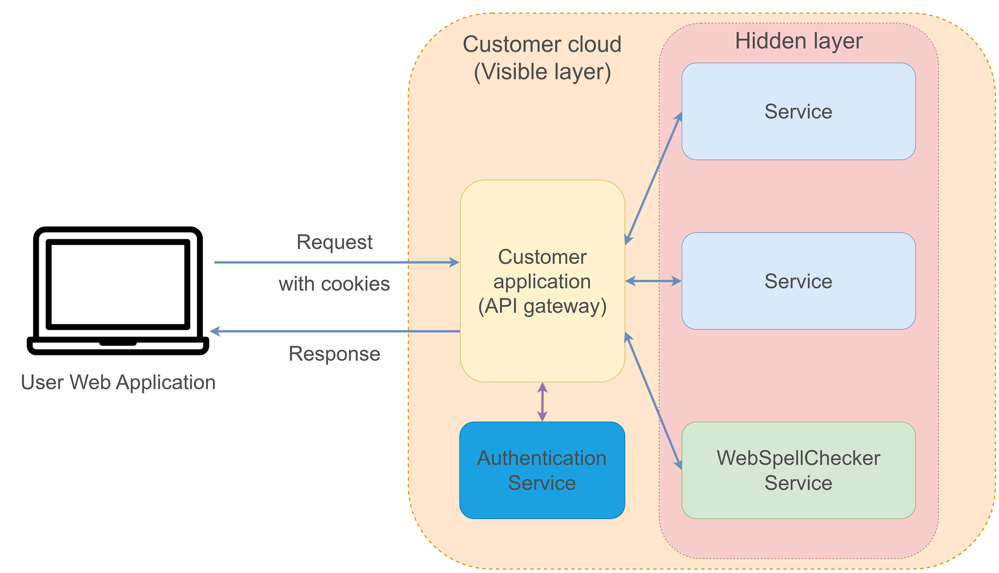

# WebSpellChecker API Gateway demo

This repository contains an API gateway example built with Python Flask.
The API gateway serves as a secured endpoint to the WebSpellChecker services and implements session-based authorization for secure access.

Using this example, you will be able to implement API gateway to both cloud/SaaS and on-premise/self-hosted product versions.

## Usage

Below you can see the diagram describing the flow of API gateway. User's frontend is configured to send
requests to API gateway endpoint. API gateway authorizes the request and proxying the request
to WebSpellChecker service endpoint. Using this approach we are able to hide WebSpellChecker endpoint
for not authorized users.



## Getting started

Follow the steps below to set up and run the API gateway.

### Prerequisites

- Python 3.x
- Required dependencies (install using `pip install -r requirements.txt`)
- WebSpellChecker product license (valid subscription to the cloud service or on-premise version deloyed)

### Running demo for cloud version

To run the demo for cloud version, launch the application specifying your service ID (activation key that you received during the subscription):

```
python main.py --serviceid <your_service_id>
```

### Running demo for on-premise version

To run demo for on-premise version, launch the application specifying the path to your WebSpellChecker service endpoint:

```
python main.py --local --protocol <http/https> --host <webspellchecker_host> --port <webspellchecker_port> --virtual_dir <webspellchecker_virtual_dir>
```

To list all available parameters, use:

```
python main.py --help
```

**Note!** Make sure that API gateway is able to reach the provided service endpoint.

### Using configured demo API gateWay

After launching, the application should be running and available under http://127.0.0.1:5000/

When you run the demo, the service is initially unavailable until the user signs in. To sign in, click `Login` button and use `username:password` predefined credentials. When a user is logged in and has a session cookie which can be sent with API requests, the WebSpellChecker service should become available on the page.

## Configure your own API gateway

While this repository provides a simple demonstration of an API gateway with session-based authorization, it is essential to implement a robust and customized solution for production environments.

Below are steps to guide you in configuring your own API gateway tailored to your specific requirements:

### Cloud version

To implement API gateway for the cloud version using your existing authorization you need to create a separate handler with a specific path, such as `/check`.

This handler can serve as the endpoint for API gateway-related requests in your production environment.

The new handler should have next logic:

1. Check if a request is authorized.
2. Save `Referer` header and put it to a proxy request.
3. Parse request body and add `serviceid` parameter with your service ID.
4. Send request to WebSpellChecker cloud endpoint: https://svc.webspellchecker.net/api
5. Return cloud's response.

Then, configure `WEBSPELLCHECKER_CONFIG` with host, port and path to your API gateway.

The example of such a handler can be found in `api_gateway_cloud` file.

### On-premise version

As in the cloud version, you need to create a separate handler with a specific path, like `/check` with the next logic:

1. Check if a request is authorized.
2. Save `Referer` header and put it to a proxy request.
3. Copy the whole request body to a proxy request.
4. Send a request to your WebSpellChecker endpoint.
5. Return the response.

Also, a handler for static files is needed. So define `/wscbundle/<path>` path handler with the next logic:

1. Check if a request is authorized.
2. Send a proxy request to your WebSpellChecker endpoint with a provided `path` in the request.
3. Return the response.

Then, configure `WEBSPELLCHECKER_CONFIG` with host, port and path to your API gateway.

The example of such a handler can be found in the `api_gateway_onprem` file.

## Important notes

- To implement such an approach to protect your cloud subscription or on-premise endpoint you need to have user authorization configured on your server side. This example implements session-based authorization using Flask-Login module for demonstration purposes and should not be used in production environments.
- When sending a proxy request, the `Referer` header and the whole request body from the original request should be preserved.
